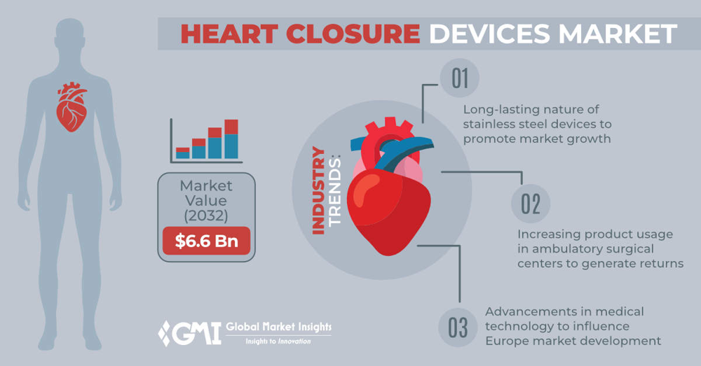
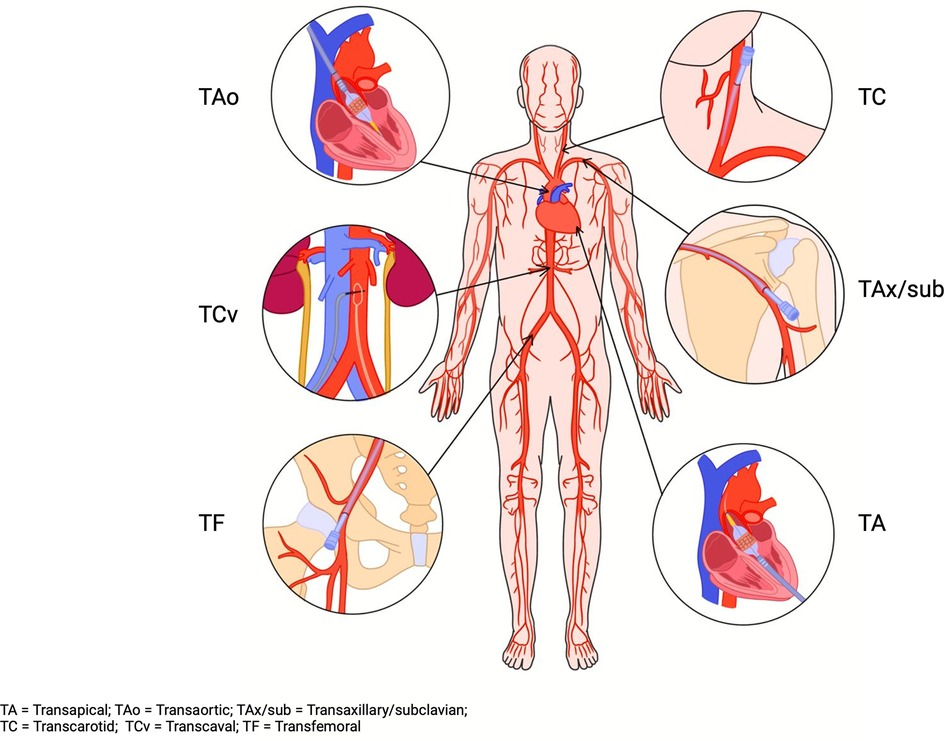

# Market Feasibility of a Dedicated Transcaval Closure Device

## Market Scope (U.S. & Global)

The proposed transcaval closure device addresses a niche but critical need in structural heart interventions. In the U.S., the primary application is facilitating fully percutaneous Transcatheter Aortic Valve Replacement (TAVR) in patients who lack adequate femoral arterial access. While **transfemoral** access is used in approximately 95% of TAVR cases, a minority (5%) require alternative routes [1]. This niche is growing as TAVR volumes rise – U.S. TAVR procedures are projected to reach **190,000+ per year by 2029** (up from ~73,000 in 2019) [2,3]. Approximately **8–12% of U.S. TAVR patients** have no suitable femoral access [4], representing thousands of cases annually that could benefit from a transcaval approach. Globally, as TAVR adoption expands (especially in Europe and Asia), similar percentages of patients present with challenging access, indicating a broader international opportunity.

Beyond TAVR, transcaval access has been successfully applied in other cardiovascular interventions – including **thoracic endovascular aortic repair (TEVAR)** and large-bore **mechanical circulatory support** – for fully percutaneous arterial access [5]. This suggests the device’s utility extends to a range of high-risk vascular procedures. Worldwide, structural heart closure devices (for septal defects and related uses) form a substantial market: the **global heart closure device industry** was valued around **$2.3–2.5 billion in 2022** and is growing rapidly (~12–15% CAGR) [6]. Analysts project the **global market to reach ~$6.6 billion by 2032** [6]. The U.S. is a major segment of this market, but emerging markets and an aging population worldwide create significant **global expansion potential** for new closure technologies.

  
*Figure: Global heart closure devices market is projected to reach **$6.6 billion** by 2032, reflecting robust growth driven by the prevalence of cardiovascular disease and the preference for minimally invasive treatments.*

## Competitive Landscape

### Existing Closure Devices

In the current landscape, there is **no commercially available device specifically designed for transcaval closure** – an unmet need that has forced physicians to improvise with off-label devices [5]. Transcaval TAVR procedures today typically use a **repurposed nitinol occluder**, such as the Amplatzer Duct Occluder (originally for patent ductus arteriosus), to plug the caval-aortic tract [7]. While this off-label solution has enabled initial cases, it has **known drawbacks**: incomplete immediate sealing, risk of device “pull-through,” and potential bleeding that may require transfusions or covered stents [7]. These limitations underscore the opportunity for a purpose-built device that offers secure, hemostatic closure in transcaval applications.

### Key Competitors in Structural Closure

The broader market for cardiac closure devices (e.g., atrial septal defect, ventricular septal defect, and patent foramen ovale occluders) is dominated by a few major players, whose products and experiences are relevant comparators:

- **Abbott (Amplatzer™ Occluder portfolio):** Market leader in transcatheter septal defect closures, with devices for ASD, VSD, PFO, and PDA. Abbott’s Amplatzer occluders hold the largest share globally [8], known for proven efficacy and physician familiarity.  
  *Strengths:* Extensive clinical data, broad size offerings, and strong physician loyalty.  
  *Weaknesses:* Devices are **not designed for transcaval use** (off-label use is suboptimal), and the nitinol mesh design can allow some residual shunt immediately post-deployment [7]. Abbott has no transcaval-specific device on the market, despite its dominance in related closure devices.

- **W.L. Gore & Associates (Cardioform Septal Occluder):** A key competitor to Abbott in septal closure. Gore’s Cardioform occluders (FDA-approved for PFO and ASD) use a soft, conformable design with an ePTFE membrane.  
  *Strengths:* Atraumatic design and an established presence in PFO closure (Gore and Abbott together lead the PFO closure market) [8].  
  *Weaknesses:* Smaller market share in ASD/VSD segment and no products targeting transcaval applications. Gore’s focus has been septal defects; it has not introduced any device for large vessel or transcaval closure, leaving that niche unaddressed.

- **Occlutech:** An emerging global player (based in Europe) offering ASD and PFO occluders. Occlutech recently achieved **FDA approval (2023)** for its ASD Occluder device and delivery system [9], signaling new competition in the U.S. market.  
  *Strengths:* Innovative design alternatives to incumbent devices and a growing international footprint (especially in Europe, Middle East).  
  *Weaknesses:* Smaller scale and limited U.S. track record; also no transcaval-specific device. Occlutech’s entry does, however, illustrate continued investor interest in the structural heart closure space.

- **Large-Bore Vascular Closure Devices:** While not direct competitors for intracardiac defects, devices like **Teleflex’s MANTA™** address similar needs in closing large arteriotomies (e.g., 18Fr+ femoral access for TAVR). MANTA, introduced in 2019, is a bio-mechanical closure device for femoral arteries that achieves rapid hemostasis with a collagen plug and toggle anchor [10].  
  *Strengths:* Specifically engineered for large-bore percutaneous closure (first of its kind) and proven in TAVR femoral closures (97.7% technical success in trials).  
  *Weaknesses:* Applicable only to femoral access sites – **not usable for transcaval tracks** (which involve an aorto-caval fistula).

- **Other Niche Competitors:** Smaller companies and devices exist for specialized closures (e.g., PFM’s Nit-Occlud for PDA, Lifetech’s Cera occluders in Asia), but their presence in the U.S. is limited. No competitor has yet launched a **dedicated transcaval closure solution**, giving the first mover a significant advantage if it can establish safety and efficacy.

**Competitive Positioning:** The new transcaval closure device would effectively **occupy a white space** in the market. Its competition is primarily the status quo of off-label device use and surgical alternatives. Key competitive advantages include a design optimized for the caval–aortic puncture (ensuring immediate and secure closure), ease of deployment in the challenging anatomy between the aorta and vena cava, and mitigation of complications seen with repurposed devices (e.g., minimized bleeding and embolization risk). Leading interventional cardiologists have explicitly cited the **lack of a dedicated device as a barrier to wider adoption** of transcaval techniques [5]. The purpose-built product enjoys a **first-in-class opportunity** with the potential to become the default tool as this approach gains traction.

## Regulatory Pathway (FDA & International)

### U.S. FDA – Early Feasibility to Approval

This device will follow the FDA’s **Class III medical device** pathway given its novel application in cardiac structure closure. The development has leveraged the FDA’s Early Feasibility Study (EFS) program, designed for first-in-human trials of innovative devices in the U.S. [11]. Early Feasibility allows a small number of patients to be enrolled with potentially less preclinical data, focusing on initial safety and device functionality. In fact, a first-in-human study of the transcaval closure device has already been reported: **12 patients** underwent transcaval TAVR with this device, achieving 100% successful tract closure at 30 days and no vascular complications. This promising EFS outcome (published in *JACC: Cardiovascular Interventions*) validates the concept and paves the way for a larger trial.

Following early feasibility, the FDA will likely require a **pivotal study** (IDE trial) to gather robust data on safety and effectiveness. The pivotal trial would enroll a larger cohort (potentially 100+ patients across multiple centers) and serve as the basis for a Premarket Approval (**PMA**) submission. The trial design may be single-arm if transcaval closure is considered a necessity (comparing outcomes to historical or registry data of alternative access) or potentially a randomized comparison against standard alternative access approaches (e.g., transaxillary or surgical cut-down). Given that transcaval TAVR is currently off-label, a single-arm study demonstrating acceptable complication rates compared to known outcomes with surgical alternatives could suffice for approval. The **FDA’s Breakthrough Device designation** could be pursued, as the device addresses a serious condition (severe AS with no femoral access) and offers a novel solution; Breakthrough status would expedite FDA interactions and review timelines. If all goes well, approval under PMA could potentially be obtained in a few years, considering the device would likely be categorized as high-risk (Class III).

### Regulatory Considerations

The transcaval closure device will need to meet rigorous safety standards. Key considerations include biocompatibility of materials (likely nitinol and polyester or similar fabrics, in line with existing occluders), durability of the implant, and the ability to withstand hemodynamic forces between the aorta and vena cava. The FDA will scrutinize risks such as device embolization, residual shunt, damage to adjacent structures, and interference with the TAVR prosthesis or vessels. The early feasibility data reported no such complications, an encouraging sign. Close consultation with the FDA (e.g., via the EFS interactive review process) will help align on required testing (bench, animal, clinical) as the device moves to pivotal study. Notably, the **EFS program** allows iterative design refinements; feedback from the first-in-human cases can be used to tweak the device before the larger trial.

### International Approvals

Outside the U.S., the device would seek a **CE Mark** in the EU and approvals in key markets like Canada, Japan, and China. The European regulatory pathway under the new Medical Device Regulation (MDR) will also treat this as a high-risk implantable device, requiring submission of technical documentation and clinical evidence of safety/performance. Often, a successful U.S. pivotal trial can be used to support CE Mark; however, some additional European-specific clinical data might be needed under MDR’s stricter evidence requirements. The timeline for CE Mark could potentially run parallel to the U.S. process – some companies obtain CE Mark earlier if they conduct a trial in Europe, but in this case the first human use was in the U.S. via EFS. An advantage is that **transcaval access experience (with off-label devices)** exists in Europe on a limited basis, so European regulators may be aware of the clinical rationale.

In markets like **China and Japan**, separate regulatory trials or bridging studies are typically required. Japan’s PMDA, for example, often accepts foreign data but may require a small local study for high-risk devices. China’s NMPA would likely require local clinical data unless the device is designated as urgently needed. Given the specialized nature of transcaval TAVR (which itself is not yet as common in some markets), the initial focus will be the U.S. and Europe, where most high-volume TAVR centers are. Achieving FDA approval and CE Mark will be pivotal, after which post-market studies and surveillance will continue to monitor long-term outcomes (e.g., ensuring the aorto-caval occlusion remains secure over years).

In summary, the regulatory pathway is well-defined: **Early Feasibility IDE → Pivotal IDE → PMA approval**, leveraging breakthrough designation if possible. Internationally, pursuing CE Mark and other key market approvals will unlock global adoption. The project has already benefited from direct NIH support under SBIR funding, reflecting regulatory and clinical buy-in for early human use. Proactive engagement with regulators and demonstrating a clear risk-benefit (life-saving in otherwise inoperable patients) will support a favorable review.

## Market Demand & Size

### TAVR Procedure Growth & Alternative Access Needs

The addressable market for a transcaval closure device closely tracks the growth of TAVR and other transcatheter therapies. TAVR has become the dominant method of aortic valve replacement, with volumes climbing each year. In 2019, U.S. TAVR cases (≈73,000) surpassed surgical AVR volumes [3], and with expansion to low-risk patients, analysts project **over 190,000 TAVR procedures annually in the U.S. by 2029** [2,3]. Worldwide TAVR adoption is similarly accelerating, with Europe not far behind the U.S. and emerging uptake in Asia-Pacific. This trajectory means the absolute number of patients who cannot undergo transfemoral TAVR (due to small or diseased femoral arteries) will also rise. Even if that remains ~5–10% of cases, we are looking at **thousands of patients per year in the U.S.** and a proportional volume globally who need an alternative access solution [4].

Currently, many of these difficult-access patients undergo transaxillary (subclavian) or transcarotid TAVR, or were historically relegated to surgical (transapical or transaortic) approaches. However, surgical TAVR has largely fallen below 1% of cases due to its invasiveness and higher morbidity. This leaves percutaneous alternative access as the growing need – a role that transcaval can fill for a subset of patients where axillary/carotid are unsuitable. For example, in one contemporary series of high-risk patients requiring alternate access, **12% were done via transcaval** (the rest via other routes). In the U.S., transcaval TAVR was first introduced around 2013–2014 and, by 2019, had been performed in at least **121 cases that year** according to the STS/ACC TVT registry. While that number is relatively small, it reflects early adoption in a procedure still considered investigational. With an approved device and more training, there is potential to convert a significant portion of the “alternative access” segment to transcaval in the future. Even capturing a few thousand cases per year in the U.S. (and similarly in the EU) would make for a healthy market, given the premium pricing of such devices.

### Septal Defect Closure Market Parallels

To gauge the market size of implantable closure devices, consider the established ASD/PFO closure space. The global PFO closure device market was about $340 million in 2023, and the global ASD/VSD device market around $171 million. Combined, that’s over **$500 million worldwide** [8] for intracardiac defect occluders, growing modestly (3–4% annually). Abbott and Gore have sold tens of thousands of occluders in these indications over the past decades. While transcaval closure is a newer, smaller indication, this context shows that specialized cardiac implants can generate hundreds of millions in revenue given widespread use and global reach. Another analogous market is **left atrial appendage (LAA) occlusion** devices (e.g., Boston Scientific’s WATCHMAN), which rapidly grew to >$500M annual revenue within a few years of approval, illustrating how novel transcatheter therapies can create large markets when they address unmet needs (in that case, stroke prevention in atrial fibrillation). The transcaval device’s market will initially be tied to TAVR volumes, but if it enables more patients to get TAVR who otherwise couldn’t, it has a clear **value proposition**.

### Market Penetration Estimates

Given current data, one can estimate the serviceable obtainable market. In the U.S., ~5% of projected 190k TAVRs in 2029 means ~9,500 patients might need non-femoral access. If transcaval could be used in even half of those (say ~5,000 cases annually), and each uses one closure device, that’s 5,000 devices per year in the U.S. alone. At an assumed price of ~$5,000 per device (typical for structural heart implants), the U.S. revenue potential would be on the order of **$25 million per year** in the mid-term, with upside if alternative access TAVR expands. Globally, using a similar percentage of a projected 300k+ annual TAVR volume by 2030, the number of alternative-access cases could be **15,000–20,000 worldwide**, corresponding to perhaps **$75–100 million per year** in device sales potential if transcaval captures a large share. These are rough estimates, but they demonstrate a meaningful market in the context of a single-indication device. Moreover, **off-label uses** of the device could expand the volume: for instance, using it to close intentional aorto-caval shunts created during TEVAR (thoracic aneurysm stent grafting) or large-bore ECMO cannulation, although these are smaller niches.

Another factor driving demand is that the transcaval approach could compete with other alternatives on outcomes. If data continue to show that transcaval TAVR has **comparable or lower complication rates** (e.g., lower stroke risk vs. transaxillary), heart teams may favor transcaval for certain anatomies. This device is essentially enabling a new market within a market – converting patients who might otherwise get a surgical approach or be turned down for TAVR into percutaneous cases. The SBIR-funded project summary explicitly noted that **40–50% of severe AS patients were historically unable to get surgery**; TAVR has reduced that gap, and transcaval can further ensure even high-risk patients with vascular disease can be treated. Each such conversion is a life-saving intervention that adds a TAVR procedure (and a closure device sale) that might not have occurred otherwise.

In summary, while the transcaval closure device’s market starts as a subset of TAVR, it is aligned with one of the fastest-growing areas of cardiology. The **addressable patient pool is in the low five figures annually on a global scale** in the near term, with growth linked to TAVR expansion. And because this is a high-value device per case (critical, implantable hardware), even modest adoption yields significant revenue. The broader trend toward minimally invasive cardiovascular therapy ensures that **market demand will continue to rise** for technologies that safely enable or simplify such procedures.

  
*Figure: Common access routes for TAVR. Transfemoral (TF) is first-line, while alternative approaches such as transcarotid (TC), transaxillary (TAx/subclavian), transaortic (TAo), transapical (TA), and **transcaval (TCv)** are used when needed [1,3].*

## Investment & Business Strategy

**Investor Trends:**  
The cardiovascular device field, especially structural heart, has seen robust investment and M&A activity. Innovations that solve niche but important problems often get acquired by larger players looking to complete their product portfolio. A pertinent example is Abbott’s acquisition of AGA Medical (developer of Amplatzer occluders) for **$1.3 billion** in 2010 [12], which instantly made Abbott the leader in septal closure devices. Similarly, Teleflex’s acquisition of Essential Medical (developer of the MANTA large-bore closure) in 2018 expanded Teleflex into the structural heart access arena [10]. Although the terms weren’t publicly disclosed, that deal underscores the value seen in novel access/closure technology. It’s reasonable to expect that, upon achieving clinical validation, a transcaval closure device company could be a **prime acquisition target** for large cardiovascular device firms (e.g., Edwards, Medtronic, Abbott, Boston Scientific). These strategics are actively seeking to bolster their structural heart pipelines – indeed, Medtronic and Boston Scientific have made recent investments in transcatheter valve and appendage closure startups, and Abbott continues to invest in structural heart (e.g., mitral/tricuspid repair devices). A device that complements TAVR (where Medtronic, Edwards, and Boston Scientific compete) could be attractive to any of those TAVR manufacturers as it could expand the **treatable patient population** for their valves.

**Funding and Partnerships:**  
To date, the transcaval closure project has already secured substantial **non-dilutive funding (~$10+ million in SBIR grants)** from the NIH [13]. This is a strong validation of the technology’s promise and has allowed progress through early feasibility without heavy venture dilution. As the program moves toward pivotal trials, additional funding will likely be needed for manufacturing scale-up, trial execution, and regulatory submission. Venture capital interest in structural heart remains high, as evidenced by recent large rounds (e.g., companies developing new heart pumps or valve technologies raising $50M+). The team could leverage its early clinical success to attract strategic investors or corporate partners. Options include a strategic partnership with a major device company for co-development or distribution rights. Another strategy would be to raise a Series B/C from specialist healthcare VCs to fund the pivotal trial through FDA approval, thereby increasing the company’s value before considering an acquisition or IPO.

**Commercialization Strategy:**  
If the device reaches approval, the commercialization approach will need to be targeted due to the specialized nature of transcaval TAVR. Key elements of the strategy might include:

- **KOL Engagement and Training:** Leverage the experience of early adopters (the pioneers at NIH, Emory, etc.) to train other centers. Proctoring programs and center-of-excellence workshops can help disseminate the technique. Because transcaval has a learning curve, building confidence through proctored initial cases at new hospitals will be crucial. The company should establish a robust physician education program demonstrating the device’s ease of use and safety.
- **Targeted Launch at High-Volume Centers:** Initially, focus on major TAVR centers that already encounter many alternative-access patients. In the U.S., there are ~30–50 high-volume TAVR hospitals that do the bulk of non-femoral cases; these would be prime early customers. Success at these centers can generate data and word-of-mouth that trickles down to smaller programs. Internationally, similarly target leading centers in Europe (e.g., Germany, France, UK) and key Asia-Pacific sites.
- **Demonstrating Value Proposition:** The business case to hospitals will hinge on showing that using the device (and the transcaval approach) can save costs or improve outcomes compared to alternatives. For example, avoiding a surgical cut-down or a high-risk carotid approach could reduce ICU days or complications. The device can be marketed as enabling truly percutaneous TAVR “in otherwise ineligible patients” – effectively expanding the hospital’s TAVR volume and improving patient outcomes. Health economic data may be gathered in trials to support this message.
- **Reimbursement and Coding Strategy:** Ensuring there are appropriate procedure codes (or using existing ones) will help in billing for the device. The company might pursue a new Technology Add-on Payment (NTAP) from CMS if eligible, to reimburse hospitals for this novel device in the initial years post-approval.

**M&A and Exit Outlook:**  
Given the precedent in this field, one likely scenario is a **trade sale to a larger medtech company** a year or two post-approval. If the pivotal trial shows strong results and initial sales traction, the device maker could be an attractive bolt-on acquisition in the range seen for similar technologies (possibly several hundred million dollars, depending on market uptake). Alternatively, if the company chooses to commercialize on its own, it could grow into a niche leader in access/closure devices and potentially diversify into related products (leveraging its **transcatheter electrosurgery expertise** as hinted by Transmural Systems’ broader pipeline [12]). An IPO could also be conceivable if the market opportunity expands, although current trends favor M&A.

In summary, the business strategy should focus on demonstrating clinical and economic value, scaling adoption via KOLs, and maintaining flexibility for partnership or acquisition. Investor sentiment is positive in this domain – evidenced by both government support and private funding events – as the device squarely addresses an unmet need in a multi-billion-dollar market.

## Clinical Adoption Considerations

**Hospital Adoption Trends:**  
Transcatheter therapies generally see rapid adoption at leading centers, followed by diffusion to community hospitals as confidence grows. For transcaval TAVR, adoption has so far been limited to specialized centers involved in research. Only a subset of U.S. hospitals (perhaps those in initial research or with high-risk programs) attempted transcaval access prior to a dedicated device. The **STS/ACC registry data** show transcaval cases were a tiny fraction in 2019 [7], reflecting that it was considered a last-resort technique. However, clinical experience to date has been largely positive, which bodes well for broader uptake once the technique is less technically demanding. Published studies and case series have demonstrated that transcaval access is feasible and can be as safe as other alternative routes. For example, a propensity-matched comparison found no increase in 30-day mortality or major complications with transcaval TAVR versus transaxillary/carotid approaches. In fact, transcaval cases had lower stroke rates and less acute kidney injury in some reports. These clinical outcomes are crucial selling points: hospitals will adopt a new technique if it clearly benefits patients.

**Physician Feedback and Usability:**  
Early users (from the first-in-human trial) reported that the dedicated device made the closure step straightforward, achieving 100% success in complete occlusion of the tract with no bleeding issues at 30 days [7]. Usability factors, such as the device’s deliverability through a 14–16Fr sheath and its deployment mechanism, will be refined via feedback from EFS cases. The goal is to make transcaval access and closure a **seamless addition** to the TAVR workflow, analogous to closing an ASD – a familiar procedure, just in a different location. Engaging physicians who participated in the trials as proctors and consultants will help optimize user experience and drive broader adoption.

**Training & Proctoring:**  
One challenge is that transcaval access has a learning curve (patient selection, CT planning of the target window, wire crossing technique, etc.). While the device can simplify closure, hospitals will still need comprehensive training on the overall procedure. Simulation training, step-by-step checklists, and on-site proctoring for initial cases are critical to help new centers gain confidence.

**KOL Endorsements:**  
Strong endorsements from pioneering physicians are anticipated. Early feasibility investigators have noted that the dedicated device solved the main limitation of transcaval TAVR – bleeding risk – and will enable more operators to adopt the technique safely [5]. Testimonials and real-world case studies during the early launch phase will further support broader hospital adoption.

In summary, clinical adoption is expected to ramp up deliberately: starting with expert centers, then diffusing to mid-volume centers as data accumulate and training improves. Hospital administrators will support adoption if outcomes improve (e.g., preventing a conversion to open surgery) and reimbursement is adequate.

## Pricing & Reimbursement

### Pricing Strategy

The pricing of the new closure device will likely be at a premium level consistent with specialized structural heart implants. For context, transcatheter occluders (ASD/PFO) often cost on the order of **$4,000–$8,000** each for hospitals. In Canada, an Amplatzer ASD Occluder is about **C$6,000** (≈USD $4,500) per device [8], and U.S. prices are typically higher. An older reference showed that the list price of a large Amplatzer device could be upwards of $10k, though actual hospital prices after negotiation are lower. We can expect the transcaval device, given its high-impact use, to be positioned similarly – perhaps in the $5k range per unit, which is justifiable given its complexity and the niche market. The value proposition (avoiding major surgery or enabling a TAVR that wouldn’t otherwise occur) supports a premium price.

### Reimbursement in the U.S.

In the U.S., new devices used in procedures typically work within existing billing codes or require new ones. Currently, the use of a vascular or cardiac closure device is usually bundled into the procedure payment. For example, when an interventional cardiologist uses a closure device at the end of a catheterization, Medicare does not reimburse separately for that device – it’s part of the facility fee [8]. We expect the same for a transcaval closure during TAVR. The hospital payment for TAVR (falling under MS-DRG 266 or 267 for inpatient procedures) would include all supplies and devices except the valve itself (which has a pass-through C-code for outpatient cases). Since most TAVRs are inpatient for Medicare, the hospital receives a fixed DRG payment (roughly $40–$60k, depending on comorbidities) to cover the entire stay, including device costs. This means hospitals will scrutinize the cost; if the closure device costs, say, $5k, it reduces the DRG margin. **Demonstrating that the device prevents costly complications** (e.g., avoiding emergent surgical intervention or reducing ICU stay) is key to justifying its cost.

For physicians, existing CPT codes for “Transcatheter closure of an arteriovenous fistula” or unlisted codes might be used, though physician work is usually considered part of the TAVR procedure. Dedicated CPT codes for transcaval access/closure may not exist initially; professional societies might later advocate for coding updates. Regardless, **Medicare coverage** for TAVR (via a National Coverage Determination) should extend to the procedure if performed in approved centers. Private insurers typically follow Medicare’s lead, bundling the costs similarly. One strategy could be applying for a **New Technology Add-on Payment (NTAP)** from CMS for the transcaval closure device, which would provide additional reimbursement to hospitals for a limited period until DRG weights adjust.

### Global Reimbursement

In Europe, reimbursement will vary by country. TAVR is generally covered by national health systems, and additional devices like occluders may or may not have separate reimbursement. Some countries use procedure group payments (similar to DRGs), meaning hospitals must allocate the device cost within a lump sum. Other systems might allow add-on reimbursement if justified. For instance, Germany often has supplemental payment (ZE codes) for new high-cost devices. In markets like Japan, reimbursement would likely be bundled within the Diagnosis Procedure Combination (DPC) system. The company may need to work closely with hospital administrators and payers in each major EU market to ensure device cost recognition, supported by health technology assessments (HTAs) demonstrating cost-effectiveness.

### Medicare/Insurance Policy for Comparable Devices

When PFO closure gained FDA approval in 2016, Medicare initially had no specific NCD but eventually covered it for patients with cryptogenic stroke. Similarly, ASD closures have long been covered with costs bundled into the procedure. Vascular closure devices (like Perclose or MANTA) are considered supplies. Thus, hospitals are expected to absorb the cost of the transcaval device as part of a complex TAVR case. The company can support adoption by providing economic models, bundle pricing deals with TAVR valve manufacturers, or volume discounts. Over time, if procedural efficiency and outcomes improve, the cost will be justified as part of routine care.

### International Pricing

Pricing outside the U.S. often needs to be lower due to different hospital budget constraints. However, given the device’s uniqueness, initial pricing in Europe could still be relatively high (e.g., €3,000–€5,000 per device) at leading centers. Negotiations with group purchasing organizations or health authorities will be key post-approval, along with dossiers demonstrating cost-offset benefits (such as reduced hospital stays).

### Conclusions

In conclusion, the pricing will reflect the device’s high value, with reimbursement being **indirect (through the procedure)** rather than direct. Ensuring that hospital administrators and payers recognize that **“no device, no TAVR”** for some patients helps frame the cost as enabling a life-saving procedure rather than as an optional add-on. By aligning pricing with demonstrated outcome benefits and actively managing reimbursement pathways (NTAP, coding, HTAs), the company can facilitate smoother adoption and financial acceptance in the healthcare system.

## References

- [1] STS/ACC TVT Registry Data (2019) – Data on TAVR volumes and alternative access percentages.
- [2] iData Research (Feb 2024) – U.S. heart valve replacement trends and TAVR projections.
- [3] Akkawi et al., *Frontiers in Cardiovascular Medicine* (2024) – Review of alternative TAVR access and outcomes.
- [4] NIH SBIR Grant Abstract (2018) – Project summary for transcaval closure device and patient statistics.
- [5] Lederman et al., *JACC: Cardiovascular Interventions* (2023) – Best practices and need for a dedicated transcaval closure device.
- [6] Global Market Insights – Report projecting global heart closure device market to ~$6.6 billion by 2032.
- [7] Rogers et al., *JACC: Cardiovasc. Interventions* (2019) – First-in-human study of the dedicated transcaval closure device.
- [8] Industry Reports & Abbott Publications – Data on septal occluders, pricing, and competitive positioning.
- [9] Occlutech Press Release (Jan 2024) – FDA approval for the Occlutech ASD occluder.
- [10] Teleflex’s MANTA Device Background – Information on large-bore vascular closure devices.
- [11] FDA Early Feasibility Study Guidelines – Regulatory pathway details for high-risk medical devices.
- [12] St. Jude Medical Acquisition Reports – Historical acquisitions in the structural heart device market.
- [13] NIH SBIR Funding Announcements (2018–2020) – Funding documentation for transcaval closure device development.
